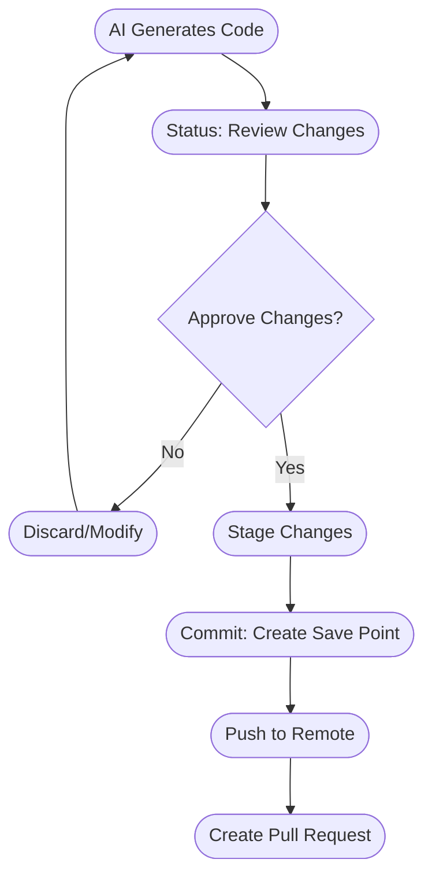
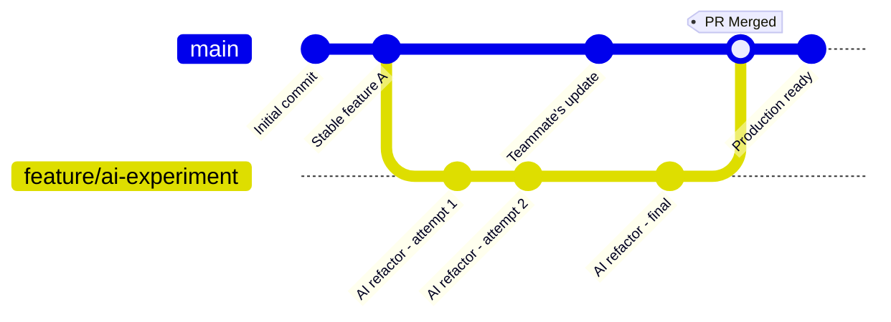
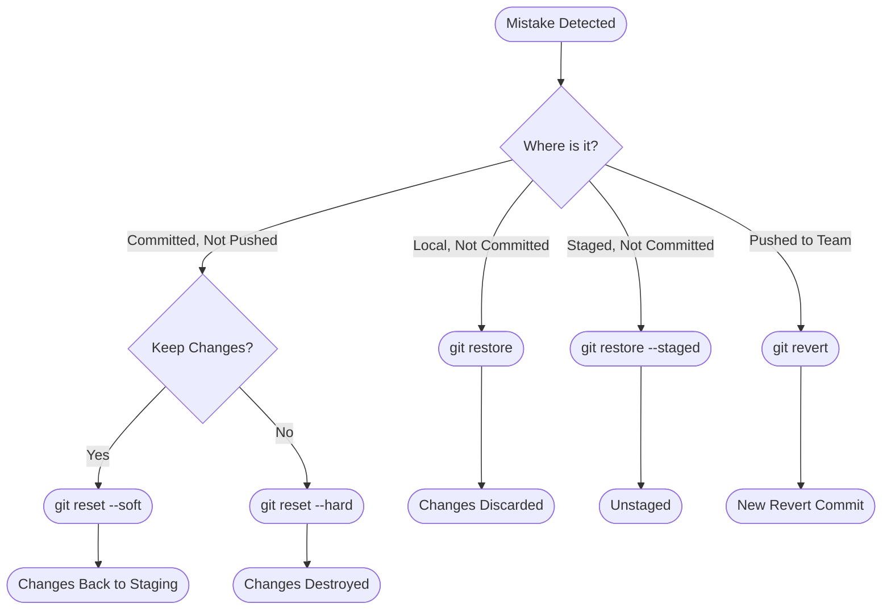
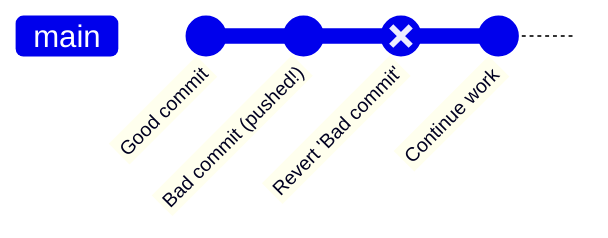
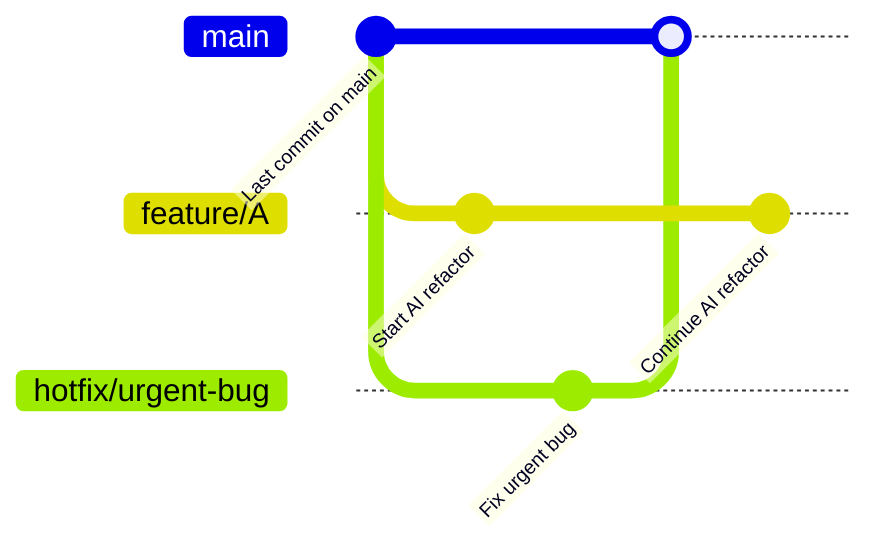
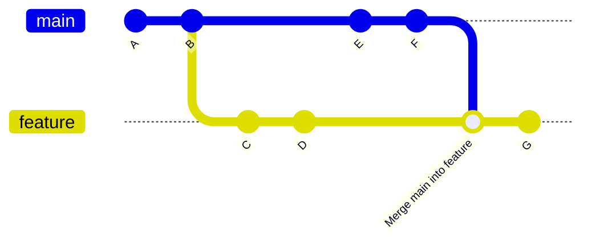
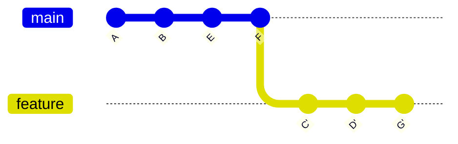
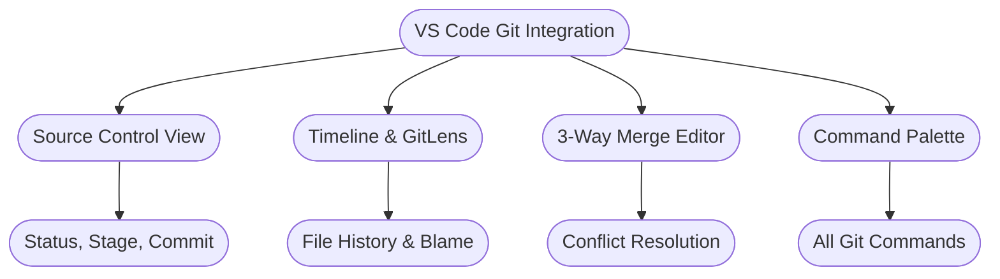
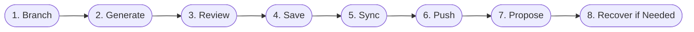

> [!TIP]
> **Learn Git by Doing!**
>
> Reading about Git is valuable, but nothing beats hands-on practice. Before you dive into the rest of this guide, we highly recommend spending 30-60 minutes with [Learn Git Branching](https://learngitbranching.js.org/)—an interactive, visual Git tutorial that runs right in your browser.
>
> This gamified environment lets you experiment with branching, merging, rebasing, and all the "undo" commands in a safe playground where mistakes are not just okay—they're encouraged. You'll build muscle memory for the exact workflows described in this guide, and when you encounter your first real merge conflict or need to rebase a branch, you'll have the confidence to do it correctly.
>
> **Trust me**: 30 minutes of interactive practice now will save you hours of panic later.

<p align="center">
    
</p>

# The AI-First Developer's Guide to Git: Version Control as a Safety Net in the Age of Generative AI

> [!IMPORTANT]
> As an engineer leveraging generative AI tools like GitHub Copilot, Cursor, or Claude Code, you are operating at an unprecedented velocity. These assistants can refactor entire modules, implement complex features, and modify dozens of files based on a single natural language prompt. This power is transformative, but in an enterprise setting, it presents a significant risk.

Your most critical tool for managing this new workflow is not the AI itself, but the 70-year-old technology concepts underpinning **Git**. For the AI-First Developer, Git is not merely a tool for collaboration; it is your essential, non-negotiable **safety net**. It is your "save game" system that allows you to experiment fearlessly, review every AI-generated change with surgical precision, and—most importantly—instantly undo any mistake.

---

## Part 1: Enterprise Onboarding: Connecting to Your Codebase

### 1.1. Scenario: First-Time Local Configuration (Your Identity)

> [!NOTE]
> **The Problem:** You have a new machine with a fresh installation of Git. Before you can make your first commit (your first "save point"), Git requires you to set your identity. This identity is not a login; it is a permanent, digital signature that will be baked into every single change you make.

**The "Why":** In an enterprise, traceability is paramount. Every line of code, every commit, must be tied to a specific individual. Using your correct enterprise name and email is a non-negotiable requirement for an auditable and professional project history.

**The Commands:**

Open your terminal (or the terminal within VS Code) and run these two commands, replacing the placeholders with your exact enterprise credentials:

```bash
git config --global user.name "Your Name"
git config --global user.email "your-enterprise-email@company.com"
```

> [!TIP]
> The `--global` flag saves this configuration for every Git repository on your computer, so you only have to do this once.

---

### 1.2. Scenario: Authentication — Tokens & SSH Keys

> [!WARNING]
> **The Problem:** Your company's code is stored in a private repository on a platform like GitHub Enterprise or GitLab. You cannot simply download it. You must first prove to the server that you are an authorized employee. GitHub removed password authentication for Git operations in 2021, so you need either a **Personal Access Token** (for HTTPS) or an **SSH key**.

#### Option 1: HTTPS with a Personal Access Token

A Personal Access Token (PAT) is a generated secret that acts as your password, but with scoped permissions and an expiration date. GitHub now recommends **fine-grained tokens**, which can be limited to specific repositories:

1. Go to your GitHub account and navigate to **Settings** (click your profile picture) → **Developer settings** → **Personal access tokens** → **Fine-grained tokens**.
2. Click **Generate new token** and give it a descriptive name (e.g., "My Work Laptop - VS Code").
3. Set an expiration date (recommend 90 days or as needed).
4. Under **Repository access**, choose **Only select repositories** and pick your project(s).
5. Under **Permissions**, set **Contents** to **Read and write** (Metadata is included automatically).
6. Click **Generate token** at the bottom.
7. **IMPORTANT:** Copy the token immediately and save it securely in your password manager (you won't be able to see it again!)

> [!NOTE]
> Some organizations still use the older **classic tokens** (same page, under "Tokens (classic)" — select the `repo` and `read:org` scopes). If your team tells you to use one, the rest of the workflow is identical.

**Using Your Token:**

When cloning a repository, use your token as the password:

```bash
git clone https://github.com/Your-Enterprise/your-project.git
# Username: your-github-username (not your full name or email!)
# Password: your-personal-access-token (paste the token you copied)
```

**Storing Your Credentials:**

To avoid entering your token every time, configure Git to remember your credentials:

```bash
# macOS - Store in Keychain (recommended)
git config --global credential.helper osxkeychain

# Windows - Use Windows Credential Manager (recommended)
git config --global credential.helper manager

# Linux - Store in encrypted file
git config --global credential.helper libsecret

# Cross-platform - Store in plain text file (use with caution on shared computers)
git config --global credential.helper store
```

> [!TIP]
> After running one of these commands, the next time you `clone`, `pull`, or `push`, Git will prompt you once for your username and token, then save it for future use. On macOS and Windows, credentials are stored securely in the system keychain.

#### Option 2: SSH Keys

SSH flips the model. Instead of pasting a secret, you generate a **key pair**: a private key that never leaves your machine, and a public key you upload to GitHub. Set it up once and every clone, pull, and push just works — no tokens to renew. It's the standard "set it and forget it" choice for a machine you develop on daily.

**Generate your key:**

```bash
ssh-keygen -t ed25519 -C "your-enterprise-email@company.com"
# Press Enter to accept the default file location,
# then choose a passphrase (recommended)
```

**Add the key to the ssh-agent:**

```bash
# macOS - store the passphrase in your Keychain
eval "$(ssh-agent -s)"
ssh-add --apple-use-keychain ~/.ssh/id_ed25519

# Windows (Git Bash) & Linux
eval "$(ssh-agent -s)"
ssh-add ~/.ssh/id_ed25519
```

**Copy your public key and add it to GitHub:**

```bash
# macOS
pbcopy < ~/.ssh/id_ed25519.pub

# Windows (Git Bash)
cat ~/.ssh/id_ed25519.pub | clip

# Linux - print it, then copy the output
cat ~/.ssh/id_ed25519.pub
```

Then go to GitHub **Settings** → **SSH and GPG keys** → **New SSH key**, paste the key, and save. Verify the connection works:

```bash
ssh -T git@github.com
# Hi your-username! You've successfully authenticated...
```

> [!IMPORTANT]
> Only ever share the `.pub` file. The private key (the one without an extension) must never leave your machine — treat it like the master key to your accounts.

With SSH, repository URLs look different — use the **SSH** tab of the green **Code** button when copying a clone URL:

```bash
git clone git@github.com:Your-Enterprise/your-project.git
# No username or token prompt - your key authenticates you
```

**Which one should you use?**

- **SSH** if it's your own machine and you push daily — one-time setup, then it disappears from your life.
- **A fine-grained token** for scripts, CI pipelines, or short-lived access to a specific repo.
- **Neither**, if a tool can sign you in through the browser — the GitHub CLI and VS Code both do this (see below).

#### The Modern Shortcut: GitHub CLI

The [GitHub CLI](https://cli.github.com) (`gh`) is GitHub's official command-line tool. Where `git` talks to the repository, `gh` talks to GitHub itself — authentication, pull requests, issues, releases — all without leaving your terminal. Download it from [cli.github.com](https://cli.github.com) or install it with your package manager:

```bash
# macOS
brew install gh

# Windows
winget install --id GitHub.cli

# Linux - see https://cli.github.com for your distro's instructions
```

Then one command handles the entire authentication setup interactively — including generating and uploading an SSH key if you ask it to:

```bash
gh auth login
# Pick HTTPS or SSH, sign in through your browser,
# and it configures Git for you
```

> [!TIP]
> Once `gh auth login` succeeds, every `git clone`, `pull`, and `push` just works — and you get bonus commands like `gh pr create` to open a pull request straight from your terminal. VS Code offers the same browser sign-in when you clone or push for the first time.

---

### 1.3. Scenario: The First Pull (Cloning the Repository)

> [!NOTE]
> **The Problem:** The code exists on the server, but not on your machine. You need to download a complete copy, or "clone," the repository.

**The Commands:**

Navigate to a folder on your machine where you store your projects. Go to the main page of your enterprise repository and click the green **<> Code** button, then copy the `https://` URL.

```bash
git clone https://github.com/Your-Enterprise/your-project.git
```

If you haven't stored your credentials yet, Git will prompt you:

- **Username:** Enter your GitHub username (not your full name or email)
- **Password:** Paste your personal access token

**The VS Code UI:**

This is often simpler, as VS Code integrates with your OS keychain and browser for authentication.

1. Open VS Code. If you see the Welcome page, click **"Clone Repository"**.
2. Alternatively, open the Command Palette (`Ctrl+Shift+P` or `Cmd+Shift+P`) and type **Git: Clone**.
3. Paste the `https://` URL. VS Code will likely open a browser window, asking you to sign in to GitHub Enterprise. This will automatically use your PAT or create one for you.
4. VS Code will then ask you where to save the repository on your machine.
5. Once cloned, open the folder (**File > Open Folder...**). You are now ready to code.

> [!NOTE]
> When you `git clone`, you only get the default branch (e.g., `main` or `master`) checked out locally. All other branches still exist, but they are "remote-tracking" branches (like `origin/feature-xyz`). You cannot see or edit them until you explicitly check them out, which is covered in Part 3.

---

## Part 2: The Core Safety Loop: Your "Save Game" for AI Coding



> [!IMPORTANT]
> This is your fundamental daily workflow, the "vibe coding" loop. It's a three-step process: you ask the AI to make a change, you review that change, and you "save" it. In Git, this loop is **Status → Stage → Commit**. For this process to be an effective safety net, it must be executed frequently. Do not wait until you have 100 changes to commit. **Commit after every single logical, working change.**

### 2.1. Scenario: "What Did the AI Just Do?"

> [!NOTE]
> **The Problem:** You prompted Copilot or Cursor to "refactor this function to be more efficient." It instantly applies changes, and you see several files in your VS Code editor tab have changed. What exactly did it touch?

**The Command:** `git status`

**What You'll See:**

This is your "heads-up display". The output will be organized into two main categories:

- **"Changes not staged for commit"** (Red): These are files that Git is tracking, which have been modified in your "Working Directory" (your local files) but have not yet been approved for your next save.
- **"Untracked files"** (Red): These are brand-new files the AI created that Git has never seen before.

**The VS Code UI:**

Look at the **Source Control** icon in the Activity Bar (the "fork" icon). It will have a blue badge with a number, showing the total number of changes. Click it. The "Source Control" panel shows the exact same information as `git status`, with "Changes" and "Untracked files" clearly listed.

---

### 2.2. Scenario: "Reviewing and Staging the AI's Work"

> [!WARNING]
> **The Problem:** `git status` shows the AI changed five files. Blindly trusting this is how bugs are introduced. You must review every line and then "stage" the changes you approve. Staging (with `git add`) is the act of moving a change from the "Working Directory" to the "Staging Area," marking it as "approved and ready for the next commit".

#### Option 1: The "Trusting" Add (Stage All)

**Command:** `git add .` (or `git add -A`)

**What it does:** Stages all modifications, all new files, and all deletions at once.

**Risk:** This is fast but dangerous. If the AI added a temporary `debug.log` file or a flawed change, you have just approved it for your commit without review.

#### Option 2: The "Surgical" Add (Stage One File)

**Command:** `git add src/my_file.py`

**What it does:** Stages only the single file you specify.

**VS Code UI:** In the Source Control panel, hover over a file in the "Changes" list and click the **+** (Stage Changes) icon. This is the UI equivalent.

#### Option 3: The "AI-First Developer's" Add (Stage Parts of a File)

> [!TIP]
> This is your single most powerful review tool, designed for exactly your use case: an AI made multiple logical changes within the same file, and you only want to accept some of them.

**Command:** `git add --patch` (or `git add -p`)

**What it does:** Instead of staging the whole file, Git will interactively walk you through every individual block of changes (called a "hunk") that the AI made. For each hunk, it will ask you:

- `y` - stage this hunk?
- `n` - do not stage this hunk?
- `s` - split this hunk into smaller pieces (if the AI mixed two unrelated changes together)?
- `q` - quit and stop staging?

This command allows you to meticulously "cherry-pick" the good parts of an AI's output and discard the bad, creating a clean, logical commit from a messy, generative change.

**VS Code UI (The "Patch" Add):** This is where the UI truly shines.

1. Go to the **Source Control** view (`Ctrl+Shift+G`).
2. Click on a file in the "Changes" list. This opens a **Diff Editor** (a side-by-side comparison).
3. Review the changes (red for deletions, green for additions).
4. To stage only specific lines, select the lines you want to stage in the green (new) or red (old) side.
5. Right-click your selection and choose **"Stage Selected Ranges"**.

This is the graphical equivalent of `git add -p` and is fundamental to safely managing AI-generated code.

---

### 2.3. Scenario: "Creating the Save Point"

> [!NOTE]
> **The Problem:** You have staged your reviewed changes. They are in the "Staging Area." Now, you must bundle them into a permanent, immutable "save point," known as a **commit**. This commit must have a message explaining why the change was made.

**The Command:**

```bash
git commit -m "feat: Add user authentication endpoint"
```

Or, if you prefer a more detailed message:

```bash
git commit
```

This will open your default text editor (like Vim or Nano) to write a longer message. A good commit message has a short subject line (under 50 characters), a blank line, and then a detailed body explaining the "why".

**Writing Good Commit Messages:**

> [!IMPORTANT]
> This is a critical engineering discipline. Your code and the AI show **how** a change was made; your commit message must explain the **why**. The enterprise standard is [Conventional Commits](https://www.conventionalcommits.org/). This practice is machine-readable and clarifies intent.

Start every commit message with a **type**:

- `feat:` A new feature for the user (e.g., `feat: Add login button to homepage`)
- `fix:` A bug fix (e.g., `fix: Resolve tensor dimension mismatch in processing loop`)
- `refactor:` A code change that neither adds a feature nor fixes a bug (e.g., `refactor: Optimize data query for performance`)
- `docs:` Documentation-only changes
- `test:` Adding missing tests or correcting existing tests

**The VS Code UI:**

1. After staging your files (they're now under the "Staged Changes" list), type your commit message into the text box at the top of the Source Control panel.
2. Click the **Commit** (checkmark) button at the top.

> [!TIP]
> **AI Integration:** This is where your tools shine. GitHub Copilot and Cursor can analyze your staged changes and suggest a commit message for you. This is a huge time-saver, but you are still responsible for ensuring the message is accurate and follows your team's standards (like Conventional Commits).

---

## Part 3: Parallel Universes: Branching for AI Experiments



> [!IMPORTANT]
> The most important rule in collaborative software development is: **you never, ever work directly on the `main` branch**. The `main` branch represents the official, stable, production-ready code. Your work, and especially your experimental AI-driven work, must happen in an isolated "parallel universe" called a **branch**.

### 3.1. Scenario: "I Have a New Idea (or AI Prompt)"

> [!NOTE]
> **The Problem:** You want to try a new feature or a massive AI-driven refactor. Before you write a single line or prompt, you must create a safe, isolated branch for this work.

**The Command:**

First, make sure you are on the `main` branch and it's up to date (`git pull`). Then, create your new branch:

```bash
git switch -c "feature/my-new-idea"
```

- `git switch` is the modern command to move between branches.
- The `-c` flag creates that branch and switches to it in one step.
- (You will also see the older command `git checkout -b "feature/my-new-idea"`, which does the exact same thing).

**The VS Code UI:**

1. Click the branch name in the bottom-left corner of the status bar.
2. A menu will appear at the top. Select **"+ Create new branch..."**.
3. Type the name (e.g., `feature/my-new-idea`) and press Enter.

> [!TIP]
> You are now in a perfect, safe copy of the `main` branch. You can now tell your AI, "Refactor the entire codebase." If the AI destroys everything, it does not matter. The `main` branch is untouched. You can simply discard this branch (`git branch -D feature/my-new-idea`) and switch back to `main`. **This workflow enables fearless experimentation.**

---

### 3.2. Scenario: "My Teammate Pushed Updates" (Syncing)

> [!NOTE]
> **The Problem:** You've been working on your `feature/my-new-idea` branch for a few days. In that time, your teammates have merged their work into `main`. Your branch is now "stale"; it doesn't have their latest code. You need to update your branch.

#### Option 1: The "Safe" Sync (git fetch + git merge)

This is a controlled, two-step process.

1. **`git fetch origin`**: This command "fetches" all the new commits from the remote server (`origin`) but does not apply them to your code. Your local `main` branch is untouched, but your "remote-tracking" branch (`origin/main`) is updated. This lets you see what's new without disrupting your work.

2. **`git merge origin/main`**: While on your feature branch, this command merges the updated `origin/main` branch into your current branch.

#### Option 2: The "Easy" Sync (git pull)

**Command:** `git pull origin main` (while on your feature branch).

**What it does:** `git pull` is simply an alias for `git fetch` followed by `git merge`, all in one command. It's convenient, but it's a "black box." Many beginners run `git pull` and are surprised when it immediately fails and reports a "merge conflict," as they didn't get a chance to review the incoming changes first.

> [!TIP]
> As a best practice, `git fetch` first to see what's coming.

---

### 3.3. Scenario: "My AI-Generated Feature is Ready" (The Pull Request)

> [!NOTE]
> **The Problem:** Your AI-assisted feature is complete, tested, and ready to be merged into the `main` branch for the whole team to use. You do not merge it directly. You "propose" the change via a **Pull Request (PR)**.

**The Workflow:**

1. **Push your branch:** From your feature branch, run:

```bash
git push -u origin feature/my-new-idea
```

The `-u` (or `--set-upstream`) flag links your local branch to a new remote branch on the server with the same name. You only need to do this the first time you push a new branch.

2. **Create the Pull Request (PR):**
   - Go to your enterprise GitHub page. You will immediately see a yellow banner: **"feature/my-new-idea had recent pushes. Compare & pull request"**.
   - Click it.
   - You will be taken to a new PR form.
     - **Base Branch**: This is the branch you want to merge into (e.g., `main`).
     - **Compare Branch**: This is the branch you want to merge (e.g., `feature/my-new-idea`).

3. **Write the PR:**
   - **Title/Description**: This is the most important part of your PR. Explain what this feature is, why it's needed, and how a reviewer can test it. Link to any project management tickets. This is where you provide the human context for your (and your AI's) work.

> [!TIP]
> **AI Integration:** GitHub Copilot can now write your PR descriptions for you by summarizing your commits. AI tools like Claude Code can even automate the PR creation process itself.

> [!IMPORTANT]
> A **Pull Request** is a request for discussion. It is the formal, auditable gate where your human teammates review your AI-generated code, suggest changes, and ultimately "sign off" on it before it is allowed into the `main` branch.

---

## Part 4: The "Undo" Toolkit: A Step-by-Step Guide to Reversing AI Mistakes



> [!IMPORTANT]
> This is the most critical section for an AI-First Developer. The AI will misunderstand a prompt. It will generate buggy code. It will delete something important. Your value as an engineer is not in preventing 100% of mistakes, but in your **ability to recover from them instantly and safely**. This is your "undo" toolkit.

### 4.1. Scenario 1: "Discard This Mess (Local, Not Committed)"

> [!NOTE]
> **The Problem:** You ran a prompt. The AI modified three files, and the result is completely wrong. You haven't staged or committed. You just want to revert those files to your last "save point" (your last commit).

**Command (To discard all local changes):** `git restore .`

**Command (To discard a single file):** `git restore src/bad_file.py`

(Older command: `git checkout -- src/bad_file.py`)

**VS Code UI:** In the Source Control panel, right-click on the file under "Changes" and select **"Discard Changes"**.

> [!CAUTION]
> This is a "dangerous" command in that your local changes are gone forever, which in this case is what you want.

---

### 4.2. Scenario 2: "I Staged This by Accident (Staged, Not Committed)"

> [!NOTE]
> **The Problem:** You used `git add .` and accidentally staged a file with a bad AI change. You need to "unstage" it (move it from "Staged Changes" back to "Changes" so you can fix it).

**Command:** `git restore --staged src/bad_file.py`

(Older command: `git reset HEAD src/bad_file.py`)

**VS Code UI:** In the Source Control panel, right-click the file under the "Staged Changes" list and select **"Unstage Changes"**.

---

### 4.3. Scenario 3: "I Forgot a File in My Last Commit"

> [!NOTE]
> **The Problem:** You just made a commit, but you missed a file, or you see a typo in your commit message. The commit has not been pushed yet.

**Command:** `git commit --amend`

**Workflow:**

1. `git add src/forgotten_file.py` (Stage the file you missed).
2. `git commit --amend --no-edit`

This command "amends" your previous commit, adding the newly staged files to it without changing the message.

If you only want to edit the message, just run `git commit --amend`.

**VS Code UI:** In the Source Control **...** menu, select **Commit → Commit Staged (Amend)**.

> [!WARNING]
> This rewrites your last commit. This is 100% SAFE if and only if you have not pushed that commit to the remote server yet.

---

### 4.4. Scenario 4: "Nuke This Whole Feature (Locally, Committed)"

> [!NOTE]
> **The Problem:** Your last three commits were a single bad AI experiment. You have not pushed them. You want to permanently delete them and go back in time to the commit before them.

**Command:** `git reset --hard HEAD~3`

**What it does:**

- `HEAD` is your current commit. `~3` means "three commits before HEAD".
- `--hard`: This is the "destructive" part. It destroys those three commits and all the code changes associated with them. Your local files are instantly reset to the state of that older commit.

**The "Safer" Resets:**

- `git reset --soft HEAD~3`: Deletes the three commits, but keeps all your code changes and leaves them in the "Staged Changes" area. Useful for "squashing" three commits into one.
- `git reset --mixed HEAD~3`: (This is the default if you don't provide a flag). Deletes the three commits, but keeps all your code changes and moves them to the "Changes" (unstaged) area.

> [!CAUTION]
> **CRITICAL WARNING:** `git reset` rewrites history. Never, ever use this on a branch that your teammates have already pulled. This is for local cleanup only.

---

### 4.5. Scenario 5: "I Pushed a Bug to the Team! (Public, Pushed)"

> [!CAUTION]
> **The Problem:** This is the critical enterprise scenario. You pushed a bad AI-generated commit. It's now on the `main` branch. Your teammates have already pulled it.

**The WRONG Solution:** You cannot use `git reset`. If you do, you are rewriting history that other people now have. This will corrupt their local repositories and cause a massive, repository-diverging nightmare.

**The RIGHT Solution:** You must create a new commit that undoes the bad commit. This is a **revert**.

**Visual Comparison:**



> [!NOTE]
> Notice how the bad commit stays in history, but a new "revert" commit undoes its changes. This is safe because no history is deleted.

**Command:** `git revert <hash-of-bad-commit>`

**Workflow:**

1. Run `git log --oneline` to find the 7-character hash of the bad commit (e.g., `a1b2c3d`).
2. Run `git revert a1b2c3d`.
3. Git will create a new commit that is the perfect inverse of `a1b2c3d`. It will pop open an editor asking you to confirm the commit message (e.g., "Revert 'feat: Add buggy AI feature'").
4. Save and close the editor.
5. Now, just `git push` this new "revert" commit.

> [!IMPORTANT]
> This is the safe, professional, and auditable way to undo a public mistake. The history now clearly shows: "Feature was added" → "Feature was reverted".

**VS Code UI:**

The **GitLens** extension (which is practically essential) makes this trivial.

1. Go to the GitLens view in the sidebar.
2. Find the bad commit in the "Commits" history.
3. Right-click the commit and select **"Revert Commit..."**.

This will create the revert commit for you. All you have to do is push.

> [!NOTE]
> Some VS Code versions have this built-in under the **...** menu or by right-clicking a commit in the Git history graph.

---

### 4.6. The "Break Glass" Command (and its Safer Sibling)

> [!WARNING]
> **The Problem:** You ignored the warnings. You used `git reset` or `git commit --amend` on a branch you already pushed. Now your local history and the remote history have "diverged." Git will correctly refuse to let you push.

**The Bad Command:** `git push --force`. This command says, "Delete whatever is on the server and replace it, unconditionally, with my local version." If a teammate pushed a commit in the last 5 minutes, you have just permanently destroyed their work.

**The Good Command:** `git push --force-with-lease`.

**What it does:** This is a conditional force push. It tells the server, "I am going to force push, but only if the remote branch is exactly where I left it when I last fetched". If your teammate has pushed a change in the meantime, the "lease" is broken, and the command will fail safely, saving you from overwriting their work.

> [!TIP]
> You should always use `git push --force-with-lease` instead of `--force`.

---

### 4.7. Table: The Git "Undo" Recovery Matrix

| Scenario (What Went Wrong?)                  | Command                                            | What It Does (Impact on History)                                         | Safe? (Local/Public)           | VS Code UI Equivalent                                             |
| -------------------------------------------- | -------------------------------------------------- | ------------------------------------------------------------------------ | ------------------------------ | ----------------------------------------------------------------- |
| "AI's change is bad, not committed."         | `git restore .`                                    | Discards all local changes in the working directory.                     | Safe (Local Only)              | Right-click file → "Discard Changes"                              |
| "AI's change was staged by accident."        | `git restore --staged <file>`                      | Unstages a file, moving it from Staging back to Changes.                 | Safe (Local Only)              | Right-click staged file → "Unstage Changes"                       |
| "I made a typo in my last commit message."   | `git commit --amend`                               | Edits the message of the most recent commit.                             | Safe (Local Only)              | ... Menu → Commit → Commit (Amend)                                |
| "I forgot a file in my last (local) commit." | `git add <file>`<br>`git commit --amend --no-edit` | Adds new files to the most recent commit.                                | Safe (Local Only)              | Stage files → ... Menu → Commit → Commit Staged (Amend)           |
| "My last 3 local commits are all bad."       | `git reset --hard HEAD~3`                          | Destroys the last 3 commits and all their code changes.                  | Local Only! (Rewrites history) | (Use GitLens) Right-click commit → Reset current branch to commit |
| "I pushed a bug to the team (public)."       | `git revert <commit-hash>`                         | Creates a new commit that is the inverse of the bad one.                 | 100% Safe (Public)             | (Use GitLens) Right-click commit → "Revert Commit..."             |
| "I reset a public branch and need to push."  | `git push --force-with-lease`                      | Forcefully overwrites the remote branch, only if no one else has pushed. | Enterprise "Break Glass"       | (None) Must be done in the terminal.                              |

---

## Part 5: Advanced Scenarios: Managing a Multi-Branch Workflow

```mermaid
graph LR
    A([Working on Feature A]) -->|Urgent Bug!| B([Stash Changes])
    B --> C([Switch to Main])
    C --> D([Create Hotfix Branch])
    D --> E([Fix Bug & Commit])
    E --> F([Push & Create PR])
    F --> G([Switch Back to Feature A])
    G --> H([Pop Stash])
    H --> I([Continue Work])
```



> [!NOTE]
> As you grow, you'll often be working on multiple tasks at once. Your AI-driven workflow will be interrupted by urgent bugs or questions from teammates. Git provides the tools to manage this context-switching seamlessly.

### 5.1. Scenario: "I Need to Switch Branches, but My Work Isn't Ready"

> [!NOTE]
> **The Problem:** You are in the middle of a complex AI refactor on `feature/A`. You have a "dirty" working directory, with 10 modified but uncommitted files. Your manager runs over: "Urgent bug on main! Drop everything!" You can't commit your half-baked work, but Git won't let you `git switch main` because you'll overwrite files.

**The Solution: The "Stash"**

The "stash" is a temporary, private holding area for your dirty changes.

**Visual:**



> [!TIP]
> The stash isn't shown in the commit graph because it's a temporary holding area outside the normal commit history. Think of it as a clipboard for your uncommitted changes.

**The Workflow:**

1. **Stash your changes:**

```bash
git stash save "WIP: refactoring pipeline, AI changes"
```

Your 10 modified files are saved, and your working directory is now "clean" (reset to your last commit).

2. **Fix the bug:**

```bash
git switch main
git pull
git switch -c "hotfix/urgent-bug"
#... (fix the bug, test, commit)...
git push -u origin hotfix/urgent-bug
#... (create PR, get it merged)...
```

3. **Return to your work:**

```bash
git switch feature/A
git stash pop
```

This command "pops" the most recent stash off the stack, re-applies all 10 of your changes, and drops the stash from your list. (Use `git stash apply` if you want to re-apply the changes but keep them in your stash list to re-use).

**The VS Code UI:**

- **To Stash:** In the Source Control **...** menu, select **Stash → Stash (Include Untracked)**. Enter a message.
- **To Pop:** In the **...** menu, select **Stash → Pop Latest Stash**.

---

### 5.2. Scenario: "My Branch is Out of Date (Rebase vs. Merge)"

> [!NOTE]
> **The Problem:** As in 3.2, your feature branch is "stale." `main` has moved on. There are two philosophies for updating it.

#### Philosophy 1: git merge main

**How:** Merges `main` into your branch. This creates a new "Merge Commit" on your branch.

**History:** This "preserves history." It's messy but 100% accurate. Your Git log will show, "Worked on feature... then merged main... then worked on feature...".

**Visual:**



#### Philosophy 2: git rebase main

**How:** This is "re-playing" your commits. It temporarily lifts your feature branch commits, rewinds your branch to the new `main`, and then re-plays your commits one-by-one on top of the new `main`.

**History:** This rewrites your local history to create a "clean, linear" log. It looks like you just started your feature today, on top of the latest `main`.

**Visual:**



> [!CAUTION]
> **The Golden Rule of Rebasing:** Never rebase a public branch (one your team is also using), as it rewrites history.

> [!TIP]
> **The AI-First Developer's Choice:** Since your `ai-experiment` branch is your private playground, **rebase** is the preferred method to keep it clean before you create a PR. Rebasing your branch makes the subsequent PR much cleaner for your teammates to review, as it won't contain 10 "I merged main" commits.

---

### 5.3. Scenario: "We Both Edited the Same File (Merge Conflicts)"

> [!WARNING]
> **The Problem:** You run `git pull` (or `merge` or `rebase`) and Git halts, screaming `CONFLICT (content): Merge conflict in src/model.py`. This means you and a teammate (or an AI and a teammate) edited the exact same lines in the exact same file. Git doesn't know which change to keep, so it stops and asks you, the human, to resolve it.

**The Command Line Workflow:**

1. `git status`: Shows you which files are "Unmerged".

2. **Open the file:** You will see the infamous conflict markers:

```javascript
<<<<<<< HEAD
// Your AI's change
const x = 10;
=======
// Your teammate's change
const x = 5;
>>>>>>> origin/main
```

3. **Edit the file:** Manually delete all the markers (`<<<`, `===`, `>>>`) and edit the code to be the correct, final version (e.g., `const x = 10;`).

4. `git add src/model.py`: This tells Git, "I have resolved this conflict".

5. `git commit`: Git will finalize the merge with a new commit.

**The VS Code UI (The Superior Way):**

> [!TIP]
> This is one of the best features of the IDE.

1. VS Code will highlight conflicting files in the Source Control panel.
2. Clicking one opens the **3-way Merge Editor**.

**What you see:**

- **Left Pane**: "Incoming" (your teammate's changes)
- **Right Pane**: "Current" (your local changes)
- **Bottom Pane**: "Result" (what will be saved)

**How to fix:** Above each conflicting block, VS Code gives you clickable links: **"Accept Current Change"** | **"Accept Incoming Change"** | **"Accept Both Changes"**.

You can click these, or edit the "Result" pane directly.

When the "Result" pane looks correct, click the **"Accept Merge"** button in the bottom-right.

This stages the file automatically. All you have to do is go back to the Source Control panel and write your `git commit` message.

---

## Part 6: Your AI-Assisted Cockpit: Mastering Git in VS Code



> [!NOTE]
> While the command line is powerful, the VS Code UI is your "cockpit". It provides rich, visual feedback that makes these abstract concepts concrete.

### 6.1. The Source Control View (Ctrl+Shift+G)

This is your command center.

- **Changes**: Your working directory (`git status`).
- **Staged Changes**: Your staging area.
- **Commit Box**: Your `git commit -m...`.
- **... Menu**: This is where all the "advanced" commands live:
  - Pull, Push
  - Stash (Stash, Pop)
  - Commit (Amend, Undo)
  - Branch (Create, Switch, Merge)
  - Revert (if supported or via extension)

---

### 6.2. The Timeline View & GitLens

> [!NOTE]
> **The Problem:** An AI changed a line of code, and you have no idea why or when.

**The Solution:**

1. Open the file in question.
2. In the "Explorer" panel (top-left), look at the bottom for a pane labeled **"Timeline"**.
3. Click it. This view shows you the complete commit history for that file only.
4. You can click any commit to see a diff, or right-click and select "Restore" to revert the file (not the whole commit).

> [!TIP]
> The **GitLens** extension (which is all but required for professional work) supercharges this by adding "blame" annotations to every single line of code, showing you who wrote that line and when.

---

### 6.3. The 3-Way Merge Editor

> [!IMPORTANT]
> As described in 5.3, this tool transforms merge conflicts from a terrifying, marker-filled text-editing nightmare into a visual, point-and-click process. This alone is a reason to use the VS Code Git integration.

---

## Part 7: Conclusion: Best Practices for AI-Augmented Teams

### 7.1. The AI-First Workflow (Summary)

This is your new "save game" loop.



1. **Branch**: `git switch -c ai-experiment/new-feature`.
2. **Generate**: "Vibe" with your AI assistant and prompt it to generate code.
3. **Review**: Use `git add -p` or the VS Code "Stage Selected Ranges" UI to meticulously review every line the AI wrote.
4. **Save**: `git commit -m "feat: <message>"`. Commit small, commit often.
5. **Sync**: `git fetch origin` followed by `git rebase origin/main` to keep your branch "clean" and up-to-date.
6. **Push**: `git push --force-with-lease` if you rebased. This updates your remote branch safely.
7. **Propose**: Create a Pull Request for human review.
8. **Recover**: If you push a mistake, never reset a public branch. Always use `git revert`.

---

### 7.2. Teaching Your AI to Use Git (The Future)

> [!TIP]
> The next level is not just using Git to manage AI; it's using AI to manage Git.

- **Cursor**: This AI-first editor allows you to create `.cursor/rules` files within your repository. You can literally teach your AI your team's Git workflow, such as "All commit messages must follow Conventional Commits" or "All new work must be on a `feature/` branch".

- **Claude Code & GitHub Actions**: You can create advanced automations where an AI agent (like Claude) automatically reviews new PRs, updates your documentation to reflect the code changes in the PR, and helps manage branches.

---

## Final Thoughts

> [!IMPORTANT]
> Your AI assistants are powerful tools that lack context and accountability. Git is your system of accountability. It provides the immutable history, the instant "undo" button, and the human-in-the-loop review layer that transforms high-velocity "Vibe Coding" from a risky hobby into a professional, safe, and scalable engineering discipline.

---

## Quick Reference Card

<table>
<tr>
<th>Task</th>
<th>Command</th>
<th>VS Code UI</th>
</tr>
<tr>
<td>Check what changed</td>
<td><code>git status</code></td>
<td>Source Control panel (Ctrl+Shift+G)</td>
</tr>
<tr>
<td>Stage specific lines</td>
<td><code>git add -p</code></td>
<td>Select lines → Right-click → "Stage Selected Ranges"</td>
</tr>
<tr>
<td>Commit changes</td>
<td><code>git commit -m "feat: message"</code></td>
<td>Type message → Click checkmark</td>
</tr>
<tr>
<td>Create new branch</td>
<td><code>git switch -c feature/name</code></td>
<td>Click branch name (bottom-left) → "Create new branch"</td>
</tr>
<tr>
<td>Discard local changes</td>
<td><code>git restore .</code></td>
<td>Right-click file → "Discard Changes"</td>
</tr>
<tr>
<td>Undo last commit (keep changes)</td>
<td><code>git reset --soft HEAD~1</code></td>
<td>GitLens → Right-click commit → Reset</td>
</tr>
<tr>
<td>Revert public commit</td>
<td><code>git revert &lt;hash&gt;</code></td>
<td>GitLens → Right-click commit → "Revert Commit"</td>
</tr>
<tr>
<td>Stash work in progress</td>
<td><code>git stash save "message"</code></td>
<td>... menu → Stash → Stash (Include Untracked)</td>
</tr>
<tr>
<td>Update branch with main</td>
<td><code>git fetch && git rebase origin/main</code></td>
<td>... menu → Pull, Rebase</td>
</tr>
<tr>
<td>Safe force push</td>
<td><code>git push --force-with-lease</code></td>
<td>Terminal only</td>
</tr>
</table>

---

> [!NOTE]
> **Remember**: Git is not just version control—it's your safety net, your time machine, and your collaboration platform. Master it, and you'll transform AI-assisted coding from a risky experiment into a superpower.
